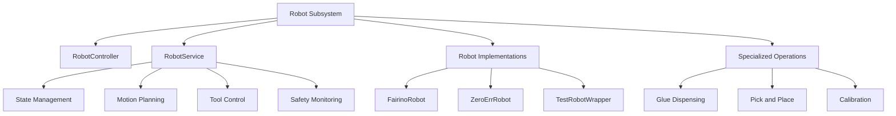

# Robot Subsystem

## Overview

The Robot subsystem provides control and integration for robotic arms used in the glue dispensing system. It supports multiple robot platforms and includes motion control, calibration, tool management, and specialized operations like pick-and-place and glue dispensing.

## Architecture



## Components

### 1. RobotController

**File**: `RobotController.py`

High-level controller handling robot API actions and external requests.

#### Initialization

```python
RobotController(robotService: RobotService)
```

**Parameters**:
- `robotService`: RobotService instance for robot control

#### Methods

##### handle(request, parts)
Routes robot commands to appropriate handlers.

**Parameters**:
- `request`: Request object
- `parts` (List[str]): Command parts (parsed endpoint)

**Command Format**: `robot/<command>/<params...>`

**Supported Commands**:

| Command | Format | Description |
|---------|--------|-------------|
| jog | `robot/jog/<axis>/<direction>/<step>` | Jog robot axis |
| move | `robot/move/<position>` | Move to position |
| stop | `robot/stop` | Stop robot motion |
| getCurrentPosition | `robot/getCurrentPosition` | Get current position |
| resetErrors | `robot/resetErrors` | Clear error state |

**Example**:
```python
# Jog X axis positive by 10mm
parts = ["robot", "jog", "X", "positive", "10"]
result = controller.handle(request, parts)
```

##### _newHandleJog(axis, direction, step)
Handles jogging commands.

**Parameters**:
- `axis` (str): Axis to jog (X, Y, Z, Rx, Ry, Rz)
- `direction` (str): "positive" or "negative"
- `step` (float): Step size in mm or degrees

##### _handleHome()
Moves robot to home position.

**Returns**: Response with operation result

##### handleMoveToPosition(parts)
Moves robot to specified coordinates.

**Parameters**:
- `parts` (List): Position data

##### _handleStop()
Stops all robot motion.

**Returns**: Response with stop result

### 2. RobotService

**File**: `robotService/RobotService.py`

Central service managing robot operations and state.

#### Initialization

```python
RobotService(
    robot,
    settingsService: SettingsService
)
```

**Parameters**:
- `robot`: Robot implementation instance (FairinoRobot or ZeroErrRobot)
- `settingsService`: Settings service for configuration

#### State Management

##### RobotServiceState

```python
class RobotServiceState(Enum):
    INITIALIZING = "initializing"
    IDLE = "idle"
    STARTING = "starting"
    MOVING_TO_FIRST_POINT = "moving_to_first_point"
    EXECUTING_PATH = "executing_path"
    TRANSITION_BETWEEN_PATHS = "transition_between_paths"
    ERROR = "error"
```

#### Key Methods

##### getCurrentPosition()
**Returns**: Current robot position (x, y, z, rx, ry, rz)

##### moveToPosition(x, y, z, rx=None, ry=None, rz=None)
Moves robot to Cartesian position.

**Parameters**:
- `x, y, z` (float): Position in mm
- `rx, ry, rz` (float, optional): Orientation in degrees

**Returns**: Success status

##### moveJoint(joint_positions)
Moves robot to joint position.

**Parameters**:
- `joint_positions` (List[float]): Joint angles in degrees

**Returns**: Success status

##### jogAxis(axis, direction, step)
Jog specific axis.

**Parameters**:
- `axis` (Axis): Axis enumeration
- `direction` (Direction): Direction enumeration
- `step` (float): Step size

##### executePath(path_points)
Executes a trajectory path.

**Parameters**:
- `path_points` (List): List of waypoints

**Returns**: Execution result

##### pickupGripper(slot_number)
Picks up gripper from tool changer.

**Parameters**:
- `slot_number` (int): Tool changer slot

##### dropOffGripper(slot_number)
Returns gripper to tool changer.

**Parameters**:
- `slot_number` (int): Tool changer slot

##### loadConfig()
Reloads robot configuration from settings.

**Returns**: Success status

### 3. FairinoRobot

**File**: `FairinoRobot.py`

Implementation for Fairino robotic arm.

#### Initialization

```python
FairinoRobot(robot_ip: str)
```

**Parameters**:
- `robot_ip` (str): Robot controller IP address

#### Enumerations

##### Axis
```python
class Axis(Enum):
    X = "X"
    Y = "Y"
    Z = "Z"
    RX = "Rx"
    RY = "Ry"
    RZ = "Rz"
```

##### Direction
```python
class Direction(Enum):
    POSITIVE = "positive"
    NEGATIVE = "negative"
```

#### Methods

##### connect()
Establishes connection to robot controller.

**Returns**: Connection status

##### disconnect()
Closes connection to robot.

##### getPosition()
**Returns**: Current position tuple (x, y, z, rx, ry, rz)

##### moveL(x, y, z, rx, ry, rz, speed=None)
Linear motion to position.

**Parameters**:
- `x, y, z` (float): Target position in mm
- `rx, ry, rz` (float): Target orientation in degrees
- `speed` (float, optional): Motion speed in mm/s

##### moveJ(joint_angles, speed=None)
Joint motion to position.

**Parameters**:
- `joint_angles` (List[float]): Target joint angles
- `speed` (float, optional): Motion speed in degrees/s

##### setDigitalOutput(io_index, value)
Controls digital output.

**Parameters**:
- `io_index` (int): I/O index
- `io_value` (bool): Output value

##### getDigitalInput(io_index)
Reads digital input.

**Parameters**:
- `io_index` (int): I/O index

**Returns**: Input state (bool)

##### setSpeed(speed)
Sets global motion speed.

**Parameters**:
- `speed` (float): Speed percentage (0-100)

##### enableRobot()
Enables robot servos.

##### disableRobot()
Disables robot servos (emergency stop).

### 4. ZeroErrRobot

**File**: `ZeroErrRobot.py`

Implementation for ZeroErr robotic arm.

Similar interface to FairinoRobot with platform-specific implementations.

### 5. TestRobotWrapper

**File**: `FairinoRobot.py` (TestRobotWrapper class)

Mock robot for testing without hardware.

**Usage**:
```python
from GlueDispensingApplication.robot.FairinoRobot import TestRobotWrapper

robot = TestRobotWrapper()
# Simulates robot operations without actual hardware
```

### 6. Glue Dispensing Operations

**Directory**: `glue_dispensing/`

**File**: `glue_dispensing/glue_dispensing_operation.py`

Specialized operations for glue application.

#### GlueDispensingOperation

**Initialization**:
```python
GlueDispensingOperation(robotService: RobotService)
```

**Methods**:

##### execute_glue_path(path, glue_settings)
Executes glue dispensing along path.

**Parameters**:
- `path` (List): Waypoints defining glue path
- `glue_settings`: Glue application parameters

**Process**:
1. Move to start position
2. Enable glue flow
3. Execute path with specified speed
4. Disable glue flow
5. Move to safe position

##### stop_operation()
Stops current dispensing operation.

##### pause_operation()
Pauses dispensing (can be resumed).

##### resume_operation()
Resumes paused operation.

### 7. Pick and Place Operations

**Directory**: `pick_and_place/`

Workpiece handling operations.

**Key Functions**:

##### pickup_workpiece(position)
Picks up workpiece from position.

**Parameters**:
- `position`: Pickup location coordinates

**Returns**: Success status

##### place_workpiece(position)
Places workpiece at position.

**Parameters**:
- `position`: Placement location coordinates

**Returns**: Success status

### 8. Calibration

**Directory**: `calibration/`

Robot calibration procedures.

**Key Operations**:
- Hand-eye calibration
- Tool center point (TCP) calibration
- Workspace calibration
- Coordinate system alignment

### 9. RobotUtils

**File**: `RobotUtils.py`

Utility functions for robot operations.

**Functions**:

##### calculate_trajectory(start, end, points_count)
Calculates trajectory points between start and end.

**Parameters**:
- `start` (tuple): Start position
- `end` (tuple): End position
- `points_count` (int): Number of intermediate points

**Returns**: List of trajectory points

##### interpolate_positions(pos1, pos2, ratio)
Interpolates between two positions.

**Parameters**:
- `pos1, pos2` (tuple): Positions
- `ratio` (float): Interpolation ratio (0-1)

**Returns**: Interpolated position

## Configuration

### Robot Configuration File

**Location**: `storage/settings/robot_config.json`

```json
{
  "robot_ip": "192.168.1.100",
  "robot_type": "fairino",
  "speed_limits": {
    "max_linear_speed": 500,
    "max_joint_speed": 180
  },
  "acceleration_limits": {
    "max_linear_accel": 1000,
    "max_joint_accel": 360
  },
  "home_position": {
    "joint_angles": [0, -90, 90, 0, 90, 0]
  },
  "work_area": {
    "x_min": -500,
    "x_max": 500,
    "y_min": -500,
    "y_max": 500,
    "z_min": 0,
    "z_max": 400
  },
  "tool_parameters": {
    "tcp_offset": [0, 0, 150, 0, 0, 0],
    "gripper_io": 1,
    "glue_valve_io": 2
  }
}
```

## Safety Features

### Workspace Limits

Robot motion restricted to configured work area:

```python
def check_workspace_limits(x, y, z):
    if not (x_min <= x <= x_max and 
            y_min <= y <= y_max and 
            z_min <= z <= z_max):
        raise WorkspaceLimitError("Position outside workspace")
```

### Collision Detection

Motion planning includes collision checking with environment.

### Emergency Stop

```python
robotService.stopRobot()  # Immediate stop
robotService.disableRobot()  # Emergency disable
```

### Error Recovery

```python
# Reset errors and recover
robotService.resetErrors()
robotService.recover()
```

## Usage Examples

### Basic Motion

```python
# Initialize robot
robot = FairinoRobot("192.168.1.100")
robotService = RobotService(robot, settingsService)

# Move to position
robotService.moveToPosition(x=100, y=200, z=300, rx=0, ry=0, rz=90)

# Get current position
position = robotService.getCurrentPosition()
print(f"Current position: {position}")
```

### Jogging

```python
# Jog X axis positive by 10mm
robotService.jogAxis(Axis.X, Direction.POSITIVE, 10)

# Jog Z axis negative by 5mm
robotService.jogAxis(Axis.Z, Direction.NEGATIVE, 5)
```

### Path Execution

```python
# Define path
path = [
    (100, 100, 200, 0, 0, 0),
    (150, 150, 200, 0, 0, 0),
    (200, 100, 200, 0, 0, 0)
]

# Execute path
result = robotService.executePath(path)
```

### Glue Dispensing

```python
glue_operation = GlueDispensingOperation(robotService)

# Execute glue path with settings
result = glue_operation.execute_glue_path(
    path=workpiece_path,
    glue_settings=glue_config
)
```

### Tool Changing

```python
# Pickup tool from slot 1
robotService.pickupGripper(slot_number=1)

# Use tool...

# Return tool to slot
robotService.dropOffGripper(slot_number=1)
```

## Error Handling

All robot operations return result objects:

```python
result = robotService.moveToPosition(x, y, z)

if result['success']:
    print("Move successful")
else:
    print(f"Move failed: {result['error']}")
    robotService.resetErrors()
```

## State Monitoring

Subscribe to robot state updates:

```python
from shared.MessageBroker import MessageBroker

broker = MessageBroker()


def on_robot_state_change(state):
    print(f"Robot state: {state}")


broker.subscribe(robotService.state_topic, on_robot_state_change)
```

## Performance Optimization

### Motion Blending

Smooth transitions between path segments:

```python
robotService.setBlendRadius(radius=5)  # 5mm blend radius
```

### Speed Optimization

Adjust speed based on path geometry:

```python
# Slow speed for tight corners
robotService.setSpeed(20)

# Normal speed for straight segments
robotService.setSpeed(50)
```

## Troubleshooting

### Robot Not Connecting

- Verify robot IP address in configuration
- Check network connectivity
- Ensure robot controller is powered on
- Check firewall settings

### Motion Errors

- Verify target position within workspace
- Check for collisions
- Ensure robot is enabled
- Review error logs

### Position Inaccuracy

- Perform robot calibration
- Check TCP offset configuration
- Verify no mechanical issues
- Update robot firmware if needed

## Dependencies

- Robot controller SDK (Fairino/ZeroErr specific)
- Network connectivity for robot communication
- SettingsService for configuration
- MessageBroker for state publishing

## Related Documentation

- [GlueDispensingApplication README](../../src/backend/system/README.md)
- [Main System README](../../docs/README.md)
- [Tools Documentation](../../src/robot_application/glue_dispensing_application/tools/README.md)
- [Calibration Documentation](./calibration/README.md)

---

**Subsystem Version**: 2.0
**Last Updated**: 2025-11-08
