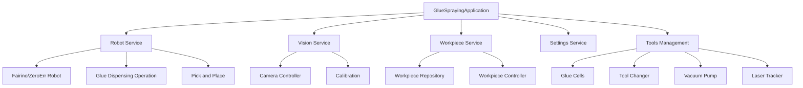

# GlueDispensingApplication Module

## Overview

The GlueDispensingApplication module is the core orchestration layer of the glue dispensing system. It coordinates robot control, vision processing, workpiece management, and tool operations to execute automated glue dispensing workflows.

## Architecture



## Main Components

### 1. GlueSprayingApplication

**File**: `GlueSprayingApplication.py`

The main application class that orchestrates all subsystems.

#### Initialization

```python
GlueSprayingApplication(
    visionService: _VisionService,
    settingsManager: SettingsService,
    workpieceService: WorkpieceService,
    robotService: RobotService
)
```

**Parameters**:
- `visionService`: Vision system instance for image processing
- `settingsManager`: Configuration management service
- `workpieceService`: Workpiece data management
- `robotService`: Robot control interface

#### Key Methods

##### start(debug=True)
Initiates the main glue dispensing workflow.

**Parameters**:
- `debug` (bool): Enable debug mode

**Returns**: Operation result status

**Workflow**:
1. Capture workpiece image
2. Match detected contours with known workpieces
3. Plan nesting if multiple workpieces detected
4. Generate spray paths
5. Execute glue dispensing

##### start_nesting(debug=True)
Executes nesting operation for multiple workpieces.

**Parameters**:
- `debug` (bool): Enable debug mode

**Returns**: Nesting result with optimized positions

##### start_spraying(workpieces, debug=True)
Executes glue spraying for specified workpieces.

**Parameters**:
- `workpieces` (List[Workpiece]): Workpieces to spray
- `debug` (bool): Enable debug mode

**Returns**: Spraying operation result

##### calibrateRobot()
Performs robot-to-camera coordinate system calibration.

**Returns**: Calibration result with transformation matrix

##### calibrateCamera()
Calibrates camera intrinsic parameters.

**Returns**: Calibration result with camera matrix and distortion coefficients

##### clean_nozzle()
Executes nozzle cleaning routine.

**Returns**: Cleaning operation status

##### stop()
Stops current glue dispensing operation.

##### pause()
Pauses current operation (can be resumed).

##### resume()
Resumes paused operation.

### 2. Application State Management

**File**: `GlueSprayApplicationState.py`

#### States

```python
class GlueSprayApplicationState(Enum):
    INITIALIZING = "initializing"
    IDLE = "idle"
    STARTED = "started"
    ERROR = "error"
```

#### ApplicationStateManager

Manages application state transitions based on subsystem states.

**Methods**:
- `update_state(new_state)`: Updates application state
- `publish_state()`: Broadcasts state changes via MessageBroker
- `onRobotServiceStateUpdate(state)`: Handles robot state changes
- `onVisonSystemStateUpdate(state)`: Handles vision system state changes

### 3. Message Publisher

**Class**: `MessagePublisher`

Publishes system events and data updates.

#### Topics

- `vision-system/brightness-region`: Brightness adjustment regions
- `robot/trajectory/updateImage`: Robot trajectory visualization
- `robot/trajectory/start`: Trajectory execution start signal
- `system/state`: System state updates

**Methods**:
- `publish_brightness_region(region)`: Publish brightness adjustment region
- `publish_trajectory_image(image)`: Publish trajectory visualization
- `publish_trajectory_start()`: Signal trajectory start
- `publish_state(state)`: Publish system state

### 4. Subscription Manager

**Class**: `SubscriptionManager`

Manages MessageBroker subscriptions.

**Methods**:
- `subscribe_all()`: Subscribe to all relevant topics
- `subscribe_mode_change()`: Subscribe to mode change events
- `subscribe_vision_topics()`: Subscribe to vision system topics
- `subscribe_robot_service_topics()`: Subscribe to robot service topics

## Handlers

### File Documentation

Each handler is documented in its own file:

| Handler | File | Purpose |
|---------|------|---------|
| Start Handler | [handle_start.md](./handlers/handle_start.md) | Main workflow orchestration |
| Camera Calibration | [camera_calibration_handler.md](./handlers/camera_calibration_handler.md) | Camera calibration procedures |
| Robot Calibration | [robot_calibration_handler.md](./handlers/robot_calibration_handler.md) | Robot calibration procedures |
| Create Workpiece | [create_workpiece_handler.md](./handlers/create_workpiece_handler.md) | Workpiece creation workflow |
| Match Workpiece | [match_workpiece_handler.md](./handlers/match_workpiece_handler.md) | Workpiece matching and recognition |
| Nesting | [nesting_handler.md](./handlers/nesting_handler.md) | Multi-workpiece nesting optimization |
| Spraying | [spraying_handler.md](./handlers/spraying_handler.md) | Glue spraying execution |
| Clean Nozzle | [clean_nozzle_handler.md](./handlers/clean_nozzle_handler.md) | Nozzle cleaning routine |
| Spray Paths | [workpieces_to_spray_paths_handler.md](./handlers/workpieces_to_spray_paths_handler.md) | Spray path generation |

## Robot Integration

**Documentation**: [robot/README.md](../../../modules/robot/README.md)

### Supported Robots

1. **Fairino Robot** (`FairinoRobot.py`)
   - Primary robot implementation
   - TCP/IP communication
   - Full feature support

2. **ZeroErr Robot** (`ZeroErrRobot.py`)
   - Alternative robot platform
   - Compatible interface

### Robot Service

**File**: `robot/robotService/RobotService.py`

Central robot control service managing:
- Robot initialization and connection
- Motion planning and execution
- Tool control
- Safety monitoring
- State management

#### RobotServiceState

```python
class RobotServiceState(Enum):
    INITIALIZING = "initializing"
    IDLE = "idle"
    STARTING = "starting"
    MOVING_TO_FIRST_POINT = "moving_to_first_point"
    EXECUTING_PATH = "executing_path"
    TRANSITION_BETWEEN_PATHS = "transition_between_paths"
    ERROR = "error"
```

## Vision Integration

**Documentation**: [vision/README.md](./vision/README.md)

### VisionService

**File**: `vision/VisionService.py`

Singleton service coordinating vision operations:
- Image capture and processing
- Contour detection
- Workpiece localization
- Calibration data management

### CameraSystemController

**File**: `vision/CameraSystemController.py`

Controller for camera system operations exposed to external interfaces.

## Workpiece Management

**Documentation**: [workpiece/README.md](../../robot_application/glue_dispensing_application/workpiece/README.md)

### Workpiece

**File**: `workpiece/Workpiece.py`

Data class representing a workpiece definition.

**Properties**:
- `name`: Workpiece identifier
- `contours`: List of contour paths
- `glue_settings`: Glue application parameters
- `tool_id`: Associated tool/nozzle
- `program_type`: Spray program variant

### WorkpieceController

**File**: `workpiece/WorkpieceController.py`

Manages workpiece CRUD operations and validation.

## Tools Management

**Documentation**: [tools/README.md](../../robot_application/glue_dispensing_application/tools/README.md)

### Glue Cells

**File**: `tools/GlueCell.py`

Manages multiple glue reservoirs with weight monitoring.

**Classes**:
- `GlueCell`: Individual glue cell
- `GlueCellsManagerSingleton`: Central manager for all glue cells
- `GlueDataFetcher`: Background thread for weight data collection

### Tool Changer

**File**: `tools/ToolChanger.py`

Automated tool/nozzle changing system.

### Laser Tracker

**File**: `tools/Laser.py`

Real-time height measurement using laser displacement sensor.

### Vacuum Pump

**File**: `tools/VacuumPump.py`

Workpiece pickup and holding system.

## Settings Management

**Documentation**: [settings/README.md](./settings/README.md)

### SettingsService

**File**: `settings/SettingsService.py`

Centralized configuration management.

**Methods**:
- `load_robot_config()`: Load robot configuration
- `load_camera_config()`: Load camera settings
- `get_camera_settings()`: Get active camera settings
- `save_settings()`: Persist configuration changes

### SettingsController

**File**: `settings/SettingsController.py`

Controller exposing settings operations to external interfaces.

## Statistics and Monitoring

**Documentation**: [statistics/STATISTICS_API_BACKEND_DOCUMENTATION.md](./statistics/STATISTICS_API_BACKEND_DOCUMENTATION.md)

Tracks and reports:
- Operation counts
- Success/failure rates
- Processing times
- Glue consumption
- Error occurrences

## Utilities

**Documentation**: [utils/README.md](./utils/README.md)

### Custom Logging

**File**: `utils/custom_logging.py`

Enhanced logging utilities with context management.

**Functions**:
- `setup_logger(name)`: Create configured logger
- `log_debug_message(context, message)`: Debug logging
- `log_info_message(context, message)`: Info logging
- `log_error_message(context, message)`: Error logging

### Contour Utilities

**File**: `utils/contours.py`

Contour processing and manipulation functions.

### File Utilities

**File**: `utils/files.py`

File I/O helper functions.

## Communication

### NewRequestHandler

**File**: `communication/NewRequestHandler.py`

HTTP request handler for API v1 operations.

**Methods**:
- `handle_request(request)`: Process incoming request
- Route requests to appropriate handlers

## Configuration Files

### Robot Configuration

**Location**: `storage/settings/robot_config.json`

```json
{
  "robot_ip": "192.168.1.100",
  "tool_parameters": {...},
  "speed_limits": {...},
  "home_positions": {...}
}
```

### Glue Cell Configuration

**Location**: `storage/glueCells/*.json`

Per-cell configuration files with:
- Cell ID and name
- Weight sensor parameters
- Capacity settings
- Alarm thresholds

## Workflow Examples

### Basic Glue Dispensing

```python
# Initialize application
app = GlueSprayingApplication(
    visionService,
    settingsService,
    workpieceService,
    robotService
)

# Calibrate if needed
if not calibrated:
    app.calibrateCamera()
    app.calibrateRobot()

# Execute dispensing
result = app.start(debug=False)
```

### Custom Workpiece Spraying

```python
# Load specific workpiece
workpiece = workpieceService.load_workpiece("part_123")

# Execute spraying for this workpiece only
app.preselected_workpiece = workpiece
result = app.start_spraying([workpiece], debug=False)
```

### Multi-Workpiece Nesting

```python
# Enable nesting mode
app.NESTING = True

# Start will automatically nest detected workpieces
result = app.start_nesting(debug=False)
```

## Error Handling

All operations return result objects with:
- `success` (bool): Operation success status
- `message` (str): Result description
- `data` (dict): Additional result data
- `error` (str): Error message if failed

Example:
```python
result = app.start()
if result['success']:
    print(f"Operation completed: {result['message']}")
else:
    print(f"Operation failed: {result['error']}")
```

## Thread Safety

The application uses threading for:
- Camera feed updates (daemon thread)
- State publishing (SystemStatePublisherThread)
- Glue cell monitoring (GlueDataFetcher)

All shared resources are protected with appropriate synchronization mechanisms.

## Dependencies

- Robot hardware (Fairino/ZeroErr)
- Camera system
- MessageBroker for inter-component communication
- Vision system for image processing
- Database for workpiece storage

## Testing

Test files are located in module-specific directories:
- `statistics/tests/`: Statistics system tests

Run tests:
```bash
python -m pytest system/statistics/tests/
```

## Related Documentation

- [Main System README](../docs/README.md)
- [VisionSystem Documentation](../VisionSystem/README.md)
- [API Documentation](../shared/README.md)
- [UI Documentation](../pl_ui/README.md)

---

**Module Version**: 2.0
**Last Updated**: 2025-11-08
