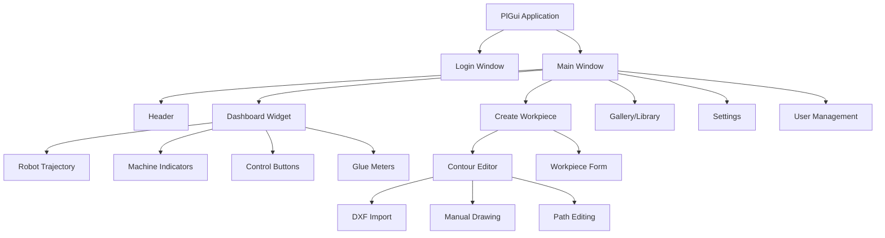
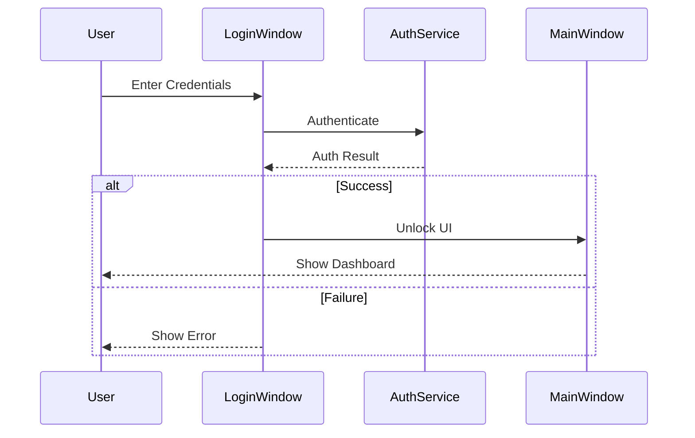
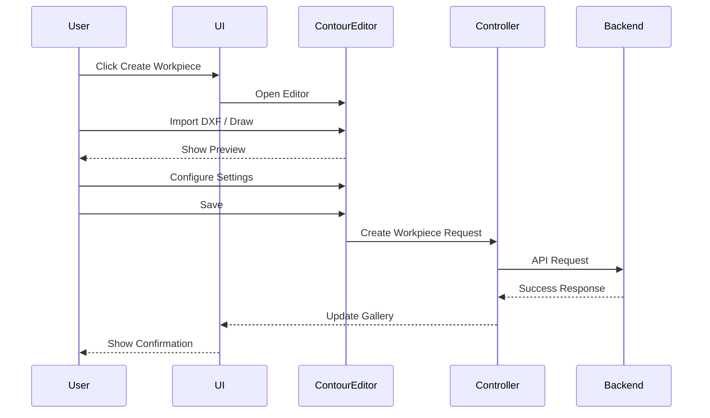
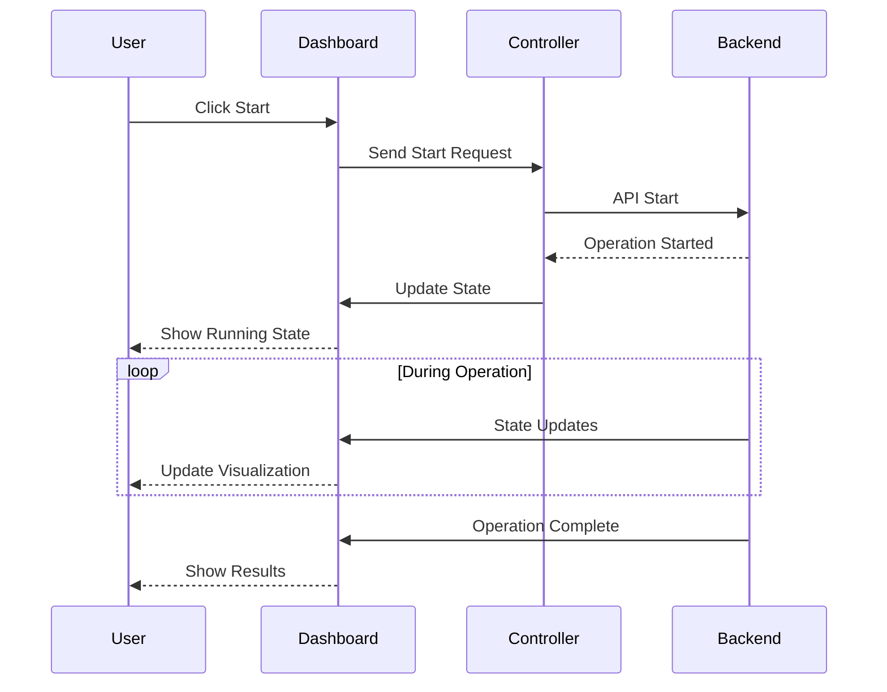

# pl_ui Module

## Overview

The pl_ui module provides the PyQt6-based graphical user interface for the glue dispensing system. It includes windows for login, dashboard, settings, workpiece creation, contour editing, and system control.

## Architecture



## Main Components

### 1. PlGui Application

**File**: `runPlUi.py`

Main application class that initializes the Qt application and windows.

#### Initialization

```python
PlGui(controller=None)
```

**Parameters**:
- `controller`: Controller instance for backend communication

#### Methods

##### start()
Starts the Qt application and shows main window.

**Behavior**:
1. Creates QApplication instance
2. Initializes localization system
3. Creates MainWindow
4. Shows login dialog if required
5. Displays main window in fullscreen or windowed mode
6. Enters Qt event loop

**Configuration**:
- `SHOW_FULLSCREEN`: Display in fullscreen mode
- `WINDOW_TITLE`: Application window title
- `requires_login`: Enable login requirement

**Example**:
```python
from pl_ui.runPlUi import PlGui
from pl_ui.controller.Controller import Controller

controller = Controller(domestic_request_sender)
gui = PlGui(controller=controller)
gui.start()
```

### 2. Main Window

**File**: `ui/windows/mainWindow/MainWindow.py`

Primary application window containing all UI components.

#### Components

##### Header
Navigation and user account controls.

##### Dashboard
Real-time system status and control panel.

##### Workpiece Management
Create, edit, and manage workpieces.

##### Settings
System configuration interface.

##### User Management
User accounts and permissions.

#### Methods

##### lock()
Locks UI when user not authenticated.

##### unlock()
Unlocks UI after successful authentication.

##### onLogEvent(event)
Handles login/logout events.

**Parameters**:
- `event`: Login event data

### 3. Login Window

**File**: `ui/windows/login/LoginWindow.py`

User authentication dialog.

#### Features

- Username/password authentication
- Role-based access control
- Session management
- Virtual keyboard support (optional)

#### Methods

##### exec()
Shows login dialog and blocks until authentication complete.

**Returns**: bool - True if login successful, False otherwise

### 4. Dashboard Widget

**File**: `ui/windows/dashboard/DashboardWidget.py`

Main control interface showing system status and controls.

#### Sub-Widgets

##### Robot Trajectory Widget
**File**: `ui/windows/dashboard/widgets/RobotTrajectoryWidget.py`

Displays robot path visualization and camera feed.

**Features**:
- Real-time camera feed
- Trajectory overlay
- Workpiece contour visualization
- Zoom and pan controls

##### Machine Indicators Widget
**File**: `ui/windows/dashboard/widgets/MachineIndicatorsWidget.py`

Shows system status indicators.

**Indicators**:
- Robot connection status
- Camera status
- Glue level
- System state
- Error indicators

##### Control Buttons Widget
**File**: `ui/windows/dashboard/widgets/ControlButtonsWidget.py`

Main operation control buttons.

**Buttons**:
- Start operation
- Stop operation
- Pause/Resume
- Emergency stop
- Clean nozzle

##### Glue Meter Widget
**File**: `ui/windows/dashboard/widgets/GlueMeterWidget.py`

Displays glue levels for all glue cells.

**Features**:
- Real-time weight monitoring
- Low level warnings
- Multiple glue cell support
- Historical consumption data

#### Dashboard Managers

##### DashboardMessageManager
**File**: `ui/windows/dashboard/managers/DashboardMessageManager.py`

Manages MessageBroker subscriptions for dashboard updates.

**Subscriptions**:
- System state updates
- Robot trajectory updates
- Glue level updates
- Camera feed updates

##### DashboardLayoutManager
**File**: `ui/windows/dashboard/managers/DashboardLayoutManager.py`

Manages dashboard layout and widget positioning.

#### Dashboard Factories

##### GlueCardFactory
**File**: `ui/windows/dashboard/factories/GlueCardFactory.py`

Creates glue meter card widgets dynamically.

**Methods**:
- `create_glue_card(glue_cell_id)`: Creates card for specific glue cell
- `update_glue_card(card, weight_data)`: Updates card with new data

### 5. Contour Editor

**Directory**: `contour_editor/`

Advanced contour editing interface for workpiece path definition.

**Main File**: `contour_editor/ContourEditor.py`

#### Features

- **DXF Import**: Load contours from DXF files
- **Manual Drawing**: Draw paths manually
- **Path Editing**: Modify existing paths
- **Segment Settings**: Configure speed, glue flow per segment
- **Visualization**: Real-time preview of paths
- **Validation**: Check path validity

#### Components

##### ContourEditor
Main editor widget with drawing canvas.

**Methods**:
- `import_dxf(filepath)`: Import DXF file
- `add_segment(segment_type, points)`: Add new path segment
- `delete_segment(segment_id)`: Remove segment
- `update_segment(segment_id, properties)`: Modify segment
- `export_workpiece()`: Export workpiece definition

##### EditorStateMachine
**Directory**: `contour_editor/EditorStateMachine/`

Manages editor modes and state transitions.

**States**:
- Idle
- Drawing
- Editing
- Selecting

##### Rendering
**Directory**: `contour_editor/rendering/`

OpenGL-based rendering for path visualization.

##### Managers
**Directory**: `contour_editor/managers/`

- Segment management
- Selection management
- Zoom/pan management
- Undo/redo management

##### Services
**Directory**: `contour_editor/services/`

- DXF parsing service
- Geometry calculation service
- Validation service

##### Widgets
**Directory**: `contour_editor/widgets/`

- Toolbar widgets
- Property panels
- Settings dialogs

### 6. Controllers

**Directory**: `controller/`

Controllers mediate between UI and backend services.

#### Controller (v1)
**File**: `controller/Controller.py`

Legacy controller for API v1.

#### ControllerV2
**File**: `controller/ControllerV2.py`

Modern controller for API v2.

**Methods**:
- `send_request(request)`: Send request to backend
- `handle_response(response)`: Process backend response
- `subscribe_to_updates()`: Subscribe to system updates

#### CreateWorkpieceManager
**File**: `controller/CreateWorkpieceManager.py`

Manages workpiece creation workflow.

**Methods**:
- `start_creation()`: Begin workpiece creation
- `validate_workpiece(data)`: Validate workpiece definition
- `save_workpiece(workpiece)`: Save to database

#### UserPermissionManager
**File**: `controller/UserPermissionManager.py`

Manages user permissions and role-based access.

**Methods**:
- `check_permission(action)`: Check if user has permission
- `get_visible_features()`: Get features visible to current user
- `restrict_access(widget)`: Hide/disable widget based on permissions

#### RequestWorker / RequestWorkerV2
**Files**: `controller/RequestWorker.py`, `controller/RequestWorkerV2.py`

Background workers for async request processing.

**Purpose**: Prevent UI blocking during long operations

### 7. Utilities

**Directory**: `utils/`

#### IconLoader
**File**: `utils/IconLoader.py`

Loads and caches UI icons.

**Methods**:
- `load_icon(name)`: Load icon by name
- `get_pixmap(name, size)`: Get scaled pixmap

#### DxfThumbnailLoader
**File**: `utils/DxfThumbnailLoader.py`

Generates thumbnails from DXF files.

**Methods**:
- `load_thumbnail(dxf_path)`: Load or generate thumbnail
- `generate_thumbnail(dxf_path, size)`: Create thumbnail image

#### FilePaths
**File**: `utils/FilePaths.py`

Centralized file path management.

**Constants**:
- `RESOURCES_DIR`: Path to resources directory
- `ICONS_DIR`: Path to icons
- `DXF_DIR`: Path to DXF files
- `STORAGE_DIR`: Path to storage directory

#### AccessCard
**File**: `utils/AccessCard.py`

Access card/badge UI widget.

#### Enums
**Directory**: `utils/enums/`

UI-related enumerations:
- `ToolID.py`: Tool/nozzle identifiers
- `WorkpieceField.py`: Workpiece form fields
- `Program.py`: Spray program types
- `Gripper.py`: Gripper types
- `GlueType.py`: Glue types

#### Styles
**Directory**: `utils/styles/`

Qt stylesheet definitions:
- `globalStyles.py`: Global application styles
- `CreateWorkpieceStyles.py`: Workpiece form styles
- `ComboBoxStyle.py`: Dropdown styles

### 8. Localization

**Directory**: `localization/`

Multi-language UI support.

**Documentation**: [localization/MIGRATION_GUIDE.md](../core/utils/localization/MIGRATION_GUIDE.md)

#### Setup

```python
from pl_ui.localization import setup_localization

# Initialize at app startup
setup_localization()
```

#### Components

##### Translator
**File**: `localization/translator.py`

Translation engine.

**Methods**:
- `set_language(lang_code)`: Switch language
- `translate(key)`: Get translated text
- `get_available_languages()`: List supported languages

##### Translation Keys
**File**: `localization/keys.py`

Centralized translation key constants.

```python
class TranslationKeys:
    START = "common.start"
    STOP = "common.stop"
    SAVE = "common.save"
    CANCEL = "common.cancel"
```

##### Localization Mixins
**File**: `localization/mixins.py`

Mixin classes for localizable widgets.

```python
class LocalizableMixin:
    def retranslate(self):
        """Update widget text with current language"""
```

##### Localized Widgets
**File**: `localization/widgets.py`

Pre-built localizable widgets:
- `LocalizedLabel`
- `LocalizedButton`
- `LocalizedAction`

#### Usage Example

```python
from pl_ui.localization.widgets import LocalizedButton
from pl_ui.localization.keys import TranslationKeys

button = LocalizedButton(TranslationKeys.START)
# Button text automatically updates when language changes
```

### 9. Authorization

**File**: `authorization/authorizationService.py`

User authentication and authorization service.

**Methods**:
- `authenticate(username, password)`: Verify credentials
- `check_permission(user, action)`: Check user permission
- `get_user_role(user)`: Get user role
- `log_access(user, action)`: Log access attempts

### 10. Configuration

**Directory**: `config/`

UI configuration files.

#### create_workpiece_config.json
Workpiece creation form configuration.

```json
{
  "fields": [
    {
      "name": "workpiece_name",
      "type": "text",
      "required": true,
      "label": "Workpiece Name"
    }
  ]
}
```

#### role_visibility.json
Role-based feature visibility.

```json
{
  "admin": {
    "features": ["all"]
  },
  "operator": {
    "features": ["start", "stop", "view_dashboard"],
    "hidden": ["settings", "user_management"]
  }
}
```

#### workpiece_form_config.json
Workpiece form field definitions.

### 11. Resources

**Directory**: `resources/`

UI resources including images and icons:

- `logo.ico`: Application icon
- `Background_&_Logo.png`: Main background
- `START_BUTTON.png`: Start button icon
- `STOP_BUTTON.png`: Stop button icon
- `CALIBRATION_BUTTON_SQUARE.png`: Calibration icon
- `SETTINGS_BUTTON.png`: Settings icon
- Various workpiece and tool icons

### 12. Testing

**Directory**: `tests/`

UI component tests.

#### Test Files

- `CameraFeedTest.py`: Camera feed widget tests
- `DashboardTest.py`: Dashboard widget tests
- `HeaderTest.py`: Header component tests
- `LoginWindowTest.py`: Login dialog tests
- `MainWindowTest.py`: Main window tests
- `RobotTrajectoryWidgetTest.py`: Trajectory widget tests
- `ToastWidgetTest.py`: Toast notification tests
- `mocks.py`: Mock objects for testing

#### Running Tests

```bash
python -m pytest pl_ui/tests/
```

## UI Workflows

### Login Flow



### Workpiece Creation Flow



### Operation Start Flow



## Styling

The UI uses Qt stylesheets (QSS) for consistent appearance.

### Global Styles

**File**: `utils/styles/globalStyles.py`

```python
GLOBAL_STYLE = """
QMainWindow {
    background-color: #f0f0f0;
}

QPushButton {
    background-color: #4CAF50;
    color: white;
    border-radius: 5px;
    padding: 10px;
}

QPushButton:hover {
    background-color: #45a049;
}
"""
```

### Widget-Specific Styles

Individual widgets can override global styles with local stylesheets.

## Event Handling

### MessageBroker Integration

Widgets subscribe to MessageBroker topics for real-time updates:

```python
from shared.MessageBroker import MessageBroker

broker = MessageBroker()


def on_state_update(state):
    self.update_indicator(state)


broker.subscribe("system/state", on_state_update)
```

### Signal-Slot Connections

Qt signals connect UI actions to handlers:

```python
self.start_button.clicked.connect(self.on_start_clicked)

def on_start_clicked(self):
    self.controller.send_start_request()
```

## Performance Optimization

### Lazy Loading

Widgets loaded on-demand to reduce startup time.

### Image Caching

Icons and thumbnails cached in memory.

### Background Workers

Long operations run in QThreads to prevent UI freezing:

```python
worker = RequestWorker(request)
worker.finished.connect(self.on_request_complete)
worker.start()
```

## Accessibility

- Keyboard shortcuts for all major functions
- High contrast mode support
- Scalable UI elements
- Screen reader compatible (Qt accessibility)

## Configuration Files Location

- **Config Directory**: `pl_ui/config/`
- **Resource Directory**: `pl_ui/resources/`
- **Storage Directory**: `storage/ui_settings/`

## Dependencies

- **PyQt6**: GUI framework
- **ezdxf**: DXF file processing
- **requests**: HTTP communication
- **API.MessageBroker**: Inter-component messaging
- **GlueDispensingApplication**: Backend services

## Related Documentation

- [Main System README](../docs/README.md)
- [API Documentation](../shared/README.md)
- [GlueDispensingApplication](../GlueDispensingApplication/README.md)
- [Localization Migration Guide](../core/utils/localization/MIGRATION_GUIDE.md)
- [Contour Editor Documentation](./contour_editor/README.md)

---

**Module Version**: 2.0
**Last Updated**: 2025-11-08
