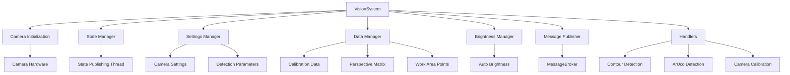

# VisionSystem Module

## Overview

The VisionSystem module provides computer vision capabilities for the glue dispensing system. It handles camera management, image processing, contour detection, calibration, and workpiece localization.

## Architecture



## Main Components

### 1. VisionSystem

**File**: `VisionSystem.py`

Core vision system class managing all vision operations.

#### Initialization

```python
VisionSystem(
    configFilePath=None,
    camera_settings=None
)
```

**Parameters**:
- `configFilePath` (str, optional): Path to configuration JSON file
- `camera_settings` (CameraSettings, optional): Pre-configured camera settings object

**Behavior**:
- If `camera_settings` provided: Uses provided settings directly
- Else if `configFilePath` provided: Loads settings from file
- Else: Uses default camera settings

#### Properties

##### cameraToRobotMatrix
```python
@property
def cameraToRobotMatrix(self) -> np.ndarray
```
**Returns**: 4x4 transformation matrix from camera to robot coordinates

##### perspectiveMatrix
```python
@property
def perspectiveMatrix(self) -> np.ndarray
```
**Returns**: 3x3 perspective transformation matrix (optional, for single-image ArUco calibration)

##### stateTopic
```python
@property
def stateTopic(self) -> str
```
**Returns**: MessageBroker topic for state updates

#### Methods

##### run()
Main processing loop - captures and processes camera frames.

**Returns**: Tuple `(contours, image, corrected_image)`
- `contours`: Detected contours (if detection enabled)
- `image`: Raw or processed image
- `corrected_image`: Undistorted and perspective-corrected image

**Processing Steps**:
1. Capture image from camera
2. Apply frame skipping if configured
3. Update state to RUNNING
4. Apply brightness adjustment if enabled
5. Detect contours if enabled
6. Apply image corrections (undistortion, perspective)

##### correctImage(imageParam)
Applies calibration corrections to an image.

**Parameters**:
- `imageParam` (np.ndarray): Input image

**Returns**: Corrected image (np.ndarray)

**Processing**:
1. Undistort image using camera matrix and distortion coefficients
2. Apply perspective transformation if available

##### captureCalibrationImage()
Captures an image for calibration purposes.

**Returns**: Calibration image capture result
- `success` (bool): Capture success status
- `image` (np.ndarray): Captured image
- `message` (str): Result message

### 2. VisionSystemState

**File**: `VisionSystem.py`

System state enumeration.

```python
class VisionSystemState(Enum):
    INITIALIZING = "initializing"
    IDLE = "idle"
    CALIBRATING = "calibrating"
    RUNNING = "running"
    ERROR = "error"
```

**State Transitions**:
- `INITIALIZING` → `RUNNING`: System initialization complete, camera active
- `RUNNING` → `CALIBRATING`: Calibration procedure started
- `CALIBRATING` → `RUNNING`: Calibration complete
- Any state → `ERROR`: Error occurred

### 3. State Manager

**File**: `state_manager.py`

Manages vision system state and publishes state changes.

**Class**: `StateManager`

#### Initialization
```python
StateManager(
    initial_state: VisionSystemState,
    message_publisher: MessagePublisher,
    log_enabled: bool = False,
    logger = None
)
```

#### Methods

##### update_state(new_state)
Updates system state if changed.

**Parameters**:
- `new_state` (VisionSystemState): New state to transition to

##### start_state_publisher_thread()
Starts background thread for periodic state publishing.

##### stop_state_publisher_thread()
Stops state publishing thread.

### 4. Camera Initialization

**File**: `camera_initialization.py`

Handles camera hardware initialization with retry logic.

**Class**: `CameraInitializer`

#### Initialization
```python
CameraInitializer(
    log_enabled: bool = False,
    logger = None,
    width: int = 1920,
    height: int = 1080
)
```

#### Methods

##### initializeCameraWithRetry(camera_index, max_retries=3)
Initializes camera with automatic retry on failure.

**Parameters**:
- `camera_index` (int): Camera device index
- `max_retries` (int): Maximum initialization attempts

**Returns**: Tuple `(camera, actual_index)`
- `camera`: Initialized camera object
- `actual_index`: Successfully connected camera index

**Retry Logic**:
- Attempts initialization with specified index
- On failure, tries alternative indices (0, 1, 2)
- Configures resolution and captures test frame
- Validates camera functionality

### 5. Settings Manager

**File**: `settings_manager.py`

Manages vision system configuration.

**Class**: `SettingsManager`

#### Methods

##### loadSettings(configFilePath)
Loads configuration from JSON file.

**Parameters**:
- `configFilePath` (str): Path to configuration file

**Returns**: Configuration dictionary

##### saveSettings(configFilePath, settings)
Saves configuration to JSON file.

**Parameters**:
- `configFilePath` (str): Path to save configuration
- `settings` (dict): Configuration data

### 6. Data Manager

**File**: `data_management.py`

Manages calibration data and system parameters.

**Class**: `DataManager`

#### Initialization
```python
DataManager(
    vision_system,
    log_enabled: bool = False,
    logger = None
)
```

#### Properties

##### cameraData
Camera calibration data (matrix and distortion coefficients)

##### cameraToRobotMatrix
Transformation matrix from camera to robot coordinates

##### perspectiveMatrix
Perspective transformation matrix

##### workAreaPoints
Work area boundary points

#### Methods

##### loadCameraCalibrationData()
Loads camera calibration data from storage.

**File Location**: `calibration/cameraCalibration/storage/calibration_result/`

##### loadCameraToRobotMatrix()
Loads camera-to-robot transformation matrix.

**File Location**: `calibration/cameraCalibration/storage/calibration_result/cameraToRobotMatrix.pkl`

##### loadPerspectiveMatrix()
Loads perspective transformation matrix.

**File Location**: `calibration/cameraCalibration/storage/calibration_result/perspectiveMatrix.pkl`

##### loadWorkAreaPoints()
Loads work area boundary points.

##### get_camera_matrix()
**Returns**: 3x3 camera matrix

##### get_distortion_coefficients()
**Returns**: Distortion coefficients array

##### print_focal_length()
Prints camera focal length information for debugging.

### 7. Brightness Manager

**File**: `brightness_manager.py`

Manages automatic brightness adjustment.

**Class**: `BrightnessManager`

#### Initialization
```python
BrightnessManager(vision_system)
```

#### Methods

##### adjust_brightness()
Analyzes current image and adjusts brightness if needed.

**Algorithm**:
1. Calculate mean brightness in target region
2. Compare with target brightness
3. Adjust exposure/gain if deviation exceeds threshold
4. Publish brightness region for visualization

### 8. Message Publisher

**File**: `message_publisher.py`

Publishes vision system events and data.

**Class**: `MessagePublisher`

#### Topics

- `vision-system/state`: System state updates
- `vision-system/contours`: Detected contours
- `vision-system/image`: Processed images
- `vision-system/brightness`: Brightness data

#### Methods

##### publish_state(state)
Publishes state change.

**Parameters**:
- `state` (VisionSystemState): Current state

##### publish_contours(contours)
Publishes detected contours.

**Parameters**:
- `contours` (List): Detected contour list

### 9. Subscription Manager

**File**: `subscribtion_manager.py`

Manages MessageBroker subscriptions for vision system.

**Class**: `SubscriptionManager`

#### Methods

##### subscribe_all()
Subscribes to all relevant topics.

**Subscribed Topics**:
- Brightness adjustment requests
- Calibration commands
- Detection parameter updates

## Handlers

### Contour Detection Handler

**File**: `handlers/contour_detection_handler.py`

**Function**: `handle_contour_detection(vision_system)`

Detects and processes contours in current image.

**Parameters**:
- `vision_system` (VisionSystem): Vision system instance

**Returns**: Tuple `(contours, image, processed_image)`

**Processing Steps**:
1. Correct image (undistort and perspective)
2. Convert to grayscale
3. Apply thresholding
4. Find contours
5. Filter by area
6. Standardize and sort contours

### ArUco Detection Handler

**File**: `handlers/aruco_detection_handler.py`

**Function**: `detect_aruco_markers(image, aruco_dict, parameters)`

Detects ArUco markers in image.

**Parameters**:
- `image` (np.ndarray): Input image
- `aruco_dict`: ArUco dictionary type
- `parameters`: Detection parameters

**Returns**: Dictionary with:
- `corners`: Marker corner coordinates
- `ids`: Detected marker IDs
- `rejected`: Rejected candidate markers

### Camera Calibration Handler

**File**: `handlers/camera_calibration_handler.py`

#### calibrate_camera(vision_system)
Performs camera calibration using ChArUco board.

**Parameters**:
- `vision_system` (VisionSystem): Vision system instance

**Returns**: Calibration result
- `success` (bool): Calibration success
- `camera_matrix` (np.ndarray): 3x3 camera matrix
- `dist_coeffs` (np.ndarray): Distortion coefficients
- `reprojection_error` (float): Calibration accuracy

**Process**:
1. Capture multiple images of ChArUco board
2. Detect ChArUco corners
3. Calculate camera matrix and distortion coefficients
4. Validate calibration quality
5. Save calibration data

#### capture_calibration_image(vision_system)
Captures single calibration image.

**Parameters**:
- `vision_system` (VisionSystem): Vision system instance

**Returns**: Capture result with image data

## Camera Calibration Service

**File**: `calibration/cameraCalibration/CameraCalibrationService.py`

Provides calibration operations for camera-to-robot coordinate transformation.

**Key Functions**:
- Multi-point calibration using robot positions
- Single-image calibration using ArUco markers
- Calibration validation and quality assessment

## Height Measuring Subsystem

**Directory**: `heightMeasuring/`

### LaserTracker

**File**: `LaserTracker.py`

Laser-based height measurement system.

**Class**: `LaserTracker`

#### Initialization
```python
LaserTracker(calibration_file='laser_calibration.json')
```

#### Methods

##### get_height()
**Returns**: Current height measurement in mm

##### calibrate(reference_heights, sensor_readings)
Calibrates laser sensor using reference points.

**Parameters**:
- `reference_heights` (List[float]): Known reference heights
- `sensor_readings` (List[float]): Corresponding sensor readings

**Returns**: Calibration result with fitted model

##### save_calibration(filepath)
Saves calibration data to file.

**Parameters**:
- `filepath` (str): Path to save calibration

## QR Code Scanner

**File**: `QRcodeScanner.py`

QR code detection and decoding.

**Function**: `scan_qr_code(image)`

**Parameters**:
- `image` (np.ndarray): Input image

**Returns**: Dictionary with:
- `success` (bool): Detection success
- `data` (str): Decoded QR code data
- `position`: QR code position in image

## Configuration

### Extended Configuration File

**File**: `extendedConfig.json`

```json
{
  "camera_index": 0,
  "camera_width": 1920,
  "camera_height": 1080,
  "skip_frames": 2,
  "brightness_auto": true,
  "brightness_target": 128,
  "contour_detection": true,
  "min_contour_area": 100,
  "max_contour_area": 50000,
  "capture_pos_offset": 150
}
```

### Configuration Parameters

| Parameter | Type | Description | Default |
|-----------|------|-------------|---------|
| `camera_index` | int | Camera device index | 0 |
| `camera_width` | int | Image width in pixels | 1920 |
| `camera_height` | int | Image height in pixels | 1080 |
| `skip_frames` | int | Frames to skip between processing | 2 |
| `brightness_auto` | bool | Enable auto brightness | true |
| `brightness_target` | int | Target brightness (0-255) | 128 |
| `contour_detection` | bool | Enable contour detection | true |
| `min_contour_area` | int | Minimum contour area (pixels) | 100 |
| `max_contour_area` | int | Maximum contour area (pixels) | 50000 |
| `capture_pos_offset` | float | Z-offset for capture position (mm) | 150 |

## Data Storage

### Calibration Data

**Location**: `calibration/cameraCalibration/storage/calibration_result/`

- `cameraData.pkl`: Camera matrix and distortion coefficients
- `cameraToRobotMatrix.pkl`: Camera-to-robot transformation
- `perspectiveMatrix.pkl`: Perspective transformation (optional)
- `cameraPoints.txt`: Camera calibration points
- `robotPoints.txt`: Robot calibration points

### Laser Calibration

**Location**: `heightMeasuring/`

- `laser_calibration.json`: Laser sensor calibration data
- `calibration_model.pkl`: Fitted calibration model

## Usage Examples

### Basic Vision System Setup

```python
from VisionSystem.VisionSystem import VisionSystem

# Initialize with default settings
vision_system = VisionSystem()

# Or with custom config file
vision_system = VisionSystem(configFilePath='path/to/config.json')

# Or with custom settings object
from shared.shared.settings.conreateSettings.CameraSettings import CameraSettings

settings = CameraSettings({'camera_index': 2, 'camera_width': 1280})
vision_system = VisionSystem(camera_settings=settings)
```

### Capture and Process Image

```python
# Run vision processing
contours, raw_image, corrected_image = vision_system.run()

# Access results
if contours:
    print(f"Detected {len(contours)} contours")
    for contour in contours:
        print(f"Contour area: {cv2.contourArea(contour)}")
```

### Camera Calibration

```python
from VisionSystem.handlers.camera_calibration_handler import calibrate_camera

# Perform calibration
result = calibrate_camera(vision_system)

if result['success']:
    print(f"Calibration complete!")
    print(f"Reprojection error: {result['reprojection_error']}")
else:
    print(f"Calibration failed: {result['error']}")
```

### Height Measurement

```python
from VisionSystem.heightMeasuring.LaserTracker import LaserTracker

# Initialize laser tracker
laser = LaserTracker()

# Get current height
height = laser.get_height()
print(f"Current height: {height} mm")
```

## Threading

The vision system runs image capture in a separate thread (daemon) to avoid blocking the main application.

```python
# Started in GlueSprayingApplication
cameraThread = threading.Thread(target=visionService.run, daemon=True)
cameraThread.start()
```

## Error Handling

All vision operations include error handling:

```python
try:
    result = vision_system.run()
except Exception as e:
    vision_system.state_manager.update_state(VisionSystemState.ERROR)
    logging.error(f"Vision error: {e}")
```

## Performance Optimization

### Frame Skipping
Skip frames to reduce processing load:
```python
camera_settings.set_skip_frames(2)  # Process every 3rd frame
```

### Region of Interest
Process only relevant image regions for better performance.

### Caching
Calibration data is cached to avoid repeated file I/O.

## Dependencies

- **opencv-python**: Image processing and computer vision
- **numpy**: Numerical operations
- **scipy**: Scientific computing (calibration)
- **API.shared**: Shared settings and models

## Related Documentation

- [Main System README](../docs/README.md)
- [GlueDispensingApplication](../GlueDispensingApplication/README.md)
- [API Documentation](../shared/README.md)
- [Camera Calibration Service](./calibration/cameraCalibration/README.md)

---

**Module Version**: 2.0
**Last Updated**: 2025-11-08
