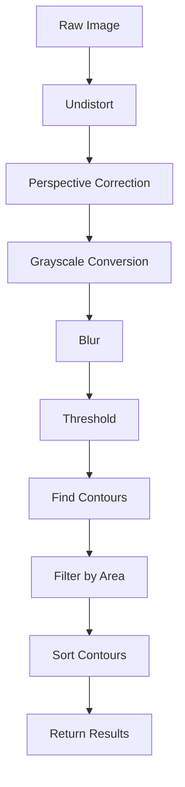

# VisionSystem Handlers Documentation

## Overview

Vision system handlers implement specific image processing operations for contour detection, marker detection, and camera calibration.

## Location

`cobot-soft-glue-dispencing-v2/VisionSystem/handlers/`

## Handler Files

### 1. contour_detection_handler.py

**Purpose**: Detects and processes contours in camera images.

#### Function: handle_contour_detection(vision_system)

Main contour detection pipeline.

**Signature**:
```python
def handle_contour_detection(
    vision_system: VisionSystem
) -> Tuple[List, np.ndarray, np.ndarray]
```

**Parameters**:
- `vision_system` (VisionSystem): Vision system instance

**Returns**: Tuple containing:
- `contours` (List): Detected and filtered contours
- `raw_image` (np.ndarray): Original captured image
- `processed_image` (np.ndarray): Corrected and processed image

**Process**:
1. **Image Acquisition**
   - Get current image from vision system
   - Apply image corrections (undistort, perspective)

2. **Preprocessing**
   - Convert to grayscale
   - Apply brightness normalization if needed
   - Apply Gaussian blur for noise reduction

3. **Thresholding**
   - Adaptive thresholding or fixed threshold
   - Binary image creation
   - Morphological operations (optional)

4. **Contour Detection**
   - Find contours using OpenCV
   - Detect hierarchy

5. **Filtering**
   - Filter by area (min/max thresholds)
   - Filter by aspect ratio
   - Remove nested contours if needed
   - Sort by area or position

6. **Standardization**
   - Convert to standardized format
   - Calculate contour properties (area, perimeter, centroid)
   - Approximate polygons if needed

**Example**:
```python
contours, raw_img, processed_img = handle_contour_detection(vision_system)

print(f"Detected {len(contours)} contours")
for contour in contours:
    area = cv2.contourArea(contour)
    print(f"Contour area: {area}")
```

**Configuration Parameters** (from vision_system settings):
- `min_contour_area`: Minimum contour area in pixels
- `max_contour_area`: Maximum contour area in pixels
- `threshold_value`: Fixed threshold value (if not adaptive)
- `use_adaptive_threshold`: Enable adaptive thresholding
- `blur_kernel_size`: Gaussian blur kernel size

**Image Processing Pipeline**:


---

### 2. aruco_detection_handler.py

**Purpose**: Detects ArUco markers for calibration and tracking.

#### Function: detect_aruco_markers(image, aruco_dict, parameters)

Detects ArUco markers in an image.

**Signature**:
```python
def detect_aruco_markers(
    image: np.ndarray,
    aruco_dict,
    parameters = None
) -> Dict[str, Any]
```

**Parameters**:
- `image` (np.ndarray): Input image
- `aruco_dict`: ArUco dictionary (e.g., cv2.aruco.DICT_4X4_50)
- `parameters`: Detection parameters (optional)

**Returns**: Dictionary with:
- `corners` (List): Marker corner coordinates
- `ids` (np.ndarray): Detected marker IDs
- `rejected` (List): Rejected marker candidates
- `success` (bool): Detection success status

**Process**:
1. Convert image to grayscale if needed
2. Detect ArUco markers using OpenCV
3. Validate detected markers
4. Return corners and IDs

**Example**:
```python
import cv2

# Create dictionary
aruco_dict = cv2.aruco.getPredefinedDictionary(cv2.aruco.DICT_4X4_50)

# Detect markers
result = detect_aruco_markers(image, aruco_dict)

if result['success']:
    print(f"Detected {len(result['ids'])} markers")
    for marker_id, corners in zip(result['ids'], result['corners']):
        print(f"Marker {marker_id}: {corners}")
```

**ArUco Dictionary Types**:
- `DICT_4X4_50`: 4x4 markers, 50 unique IDs
- `DICT_5X5_100`: 5x5 markers, 100 unique IDs
- `DICT_6X6_250`: 6x6 markers, 250 unique IDs
- `DICT_ARUCO_ORIGINAL`: Original ArUco markers

---

### 3. camera_calibration_handler.py

**Purpose**: Camera calibration using ChArUco boards.

#### Function: calibrate_camera(vision_system)

Performs full camera calibration.

**Signature**:
```python
def calibrate_camera(
    vision_system: VisionSystem,
    log_enabled: bool = False,
    logger = None
) -> Dict[str, Any]
```

**Parameters**:
- `vision_system` (VisionSystem): Vision system instance
- `log_enabled` (bool): Enable logging
- `logger`: Logger instance

**Returns**: Dictionary with:
- `success` (bool): Calibration success
- `camera_matrix` (np.ndarray): 3x3 camera intrinsic matrix
- `dist_coeffs` (np.ndarray): Distortion coefficients (k1, k2, p1, p2, k3)
- `reprojection_error` (float): RMS reprojection error
- `num_images` (int): Number of calibration images used
- `message` (str): Result message

**Process**:
1. **Image Collection**
   - Prompt user to position calibration board
   - Capture multiple images (15-30 recommended)
   - Detect ChArUco corners in each image
   - Validate detection quality

2. **Calibration Computation**
   - Collect all detected corners and IDs
   - Run camera calibration algorithm
   - Compute camera matrix and distortion coefficients
   - Calculate reprojection error

3. **Validation**
   - Check reprojection error (should be < 1.0 pixel)
   - Verify reasonable focal lengths
   - Check principal point near image center

4. **Save Results**
   - Save camera matrix
   - Save distortion coefficients
   - Save calibration images for reference
   - Update vision system

**Example**:
```python
result = calibrate_camera(vision_system, log_enabled=True, logger=my_logger)

if result['success']:
    print("Calibration successful!")
    print(f"Camera matrix:\n{result['camera_matrix']}")
    print(f"Distortion coeffs: {result['dist_coeffs']}")
    print(f"Reprojection error: {result['reprojection_error']:.4f} pixels")
    print(f"Used {result['num_images']} images")
else:
    print(f"Calibration failed: {result['message']}")
```

**Calibration Board Requirements**:
- ChArUco board (combination of ArUco markers and chessboard)
- Known board dimensions
- Flat, rigid mounting
- Good lighting without glare

**Recommended Capture Positions**:
- Center of field of view
- All four corners
- Various angles (tilted 15-30 degrees)
- Different distances from camera

#### Function: capture_calibration_image(vision_system)

Captures a single calibration image.

**Signature**:
```python
def capture_calibration_image(
    vision_system: VisionSystem,
    log_enabled: bool = False,
    logger = None
) -> Dict[str, Any]
```

**Parameters**:
- `vision_system` (VisionSystem): Vision system instance
- `log_enabled` (bool): Enable logging
- `logger`: Logger instance

**Returns**: Dictionary with:
- `success` (bool): Capture success
- `image` (np.ndarray): Captured image
- `corners_detected` (bool): Whether corners were detected
- `num_corners` (int): Number of corners detected
- `message` (str): Result message

**Process**:
1. Capture image from camera
2. Detect ChArUco corners
3. Validate detection
4. Return image and detection result

**Example**:
```python
result = capture_calibration_image(vision_system)

if result['success'] and result['corners_detected']:
    print(f"Captured image with {result['num_corners']} corners")
    cv2.imshow("Calibration Image", result['image'])
else:
    print(f"Capture failed or no corners: {result['message']}")
```

---

## Configuration

### Contour Detection Settings

**File**: `VisionSystem/extendedConfig.json`

```json
{
  "contour_detection": true,
  "min_contour_area": 100,
  "max_contour_area": 50000,
  "threshold_value": 127,
  "use_adaptive_threshold": true,
  "adaptive_threshold_block_size": 11,
  "adaptive_threshold_c": 2,
  "blur_kernel_size": 5,
  "morphology_enabled": false,
  "morphology_kernel_size": 3
}
```

### ArUco Detection Settings

```json
{
  "aruco_dict_type": "DICT_4X4_50",
  "aruco_marker_size": 50,
  "detection_parameters": {
    "adaptiveThreshWinSizeMin": 3,
    "adaptiveThreshWinSizeMax": 23,
    "adaptiveThreshWinSizeStep": 10,
    "minMarkerPerimeterRate": 0.03,
    "maxMarkerPerimeterRate": 4.0,
    "polygonalApproxAccuracyRate": 0.05
  }
}
```

### Camera Calibration Settings

```json
{
  "charuco_board": {
    "squares_x": 5,
    "squares_y": 7,
    "square_length": 40,
    "marker_length": 30,
    "dict_type": "DICT_4X4_50"
  },
  "min_calibration_images": 15,
  "max_reprojection_error": 1.0
}
```

## Common Issues and Solutions

### Contour Detection

**Problem**: Too many contours detected
- **Solution**: Increase `min_contour_area`
- **Solution**: Improve lighting consistency
- **Solution**: Clean work surface

**Problem**: Missing contours
- **Solution**: Decrease `min_contour_area`
- **Solution**: Adjust threshold settings
- **Solution**: Check camera focus

### ArUco Detection

**Problem**: Markers not detected
- **Solution**: Ensure correct dictionary type
- **Solution**: Improve lighting
- **Solution**: Check marker print quality
- **Solution**: Reduce motion blur

### Camera Calibration

**Problem**: High reprojection error
- **Solution**: Capture more images
- **Solution**: Use wider variety of angles
- **Solution**: Ensure board is flat and rigid
- **Solution**: Improve lighting

**Problem**: Distorted results after calibration
- **Solution**: Recalibrate with better images
- **Solution**: Check board dimensions
- **Solution**: Verify camera resolution settings

## Testing

### Test Contour Detection

```python
def test_contour_detection():
    vision_system = VisionSystem()
    
    # Capture test image
    contours, raw, processed = handle_contour_detection(vision_system)
    
    assert len(contours) > 0, "No contours detected"
    
    # Visualize results
    img_with_contours = cv2.drawContours(
        raw.copy(), contours, -1, (0, 255, 0), 2
    )
    cv2.imshow("Contours", img_with_contours)
    cv2.waitKey(0)
```

### Test ArUco Detection

```python
def test_aruco_detection():
    # Load test image with known markers
    test_image = cv2.imread("test_aruco.jpg")
    
    aruco_dict = cv2.aruco.getPredefinedDictionary(cv2.aruco.DICT_4X4_50)
    result = detect_aruco_markers(test_image, aruco_dict)
    
    assert result['success'], "Detection failed"
    assert len(result['ids']) == 4, "Expected 4 markers"
```

## Performance Optimization

### Contour Detection
- Use ROI (Region of Interest) to limit search area
- Reduce image resolution if real-time processing needed
- Cache threshold parameters

### ArUco Detection
- Use appropriate dictionary size (smaller = faster)
- Limit search regions if marker positions known
- Adjust detection parameters for speed vs accuracy

## Related Documentation

- [VisionSystem/README.md](../README.md)
- [Camera Calibration Service](../calibration/cameraCalibration/README.md)
- [Main System README](../../README.md)

---

**Directory**: VisionSystem/handlers/
**Purpose**: Image processing and detection handlers
**Last Updated**: 2025-11-08
