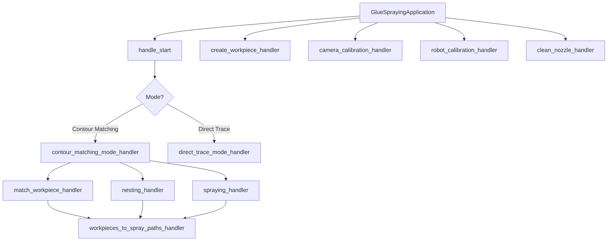

# Handlers Documentation

## Overview

Handlers are specialized modules that implement specific workflows and operations in the glue dispensing system. Each handler encapsulates the logic for a particular operation or mode.

## Location

`cobot-soft-glue-dispencing-v2/GlueDispensingApplication/handlers/`

## Handler Files

### 1. handle_start.py

**Purpose**: Main entry point for starting glue dispensing operations.

#### Function: start(application, contourMatching, nesting, debug)

Initiates the robotic glue dispensing operation.

**Signature**:
```python
def start(
    application: GlueSprayingApplication,
    contourMatching: bool = True,
    nesting: bool = False,
    debug: bool = False
) -> Tuple[bool, str]
```

**Parameters**:
- `application` (GlueSprayingApplication): Main application instance
- `contourMatching` (bool): Enable contour matching mode (default: True)
  - `True`: Detect workpieces and match with known patterns
  - `False`: Use direct trace mode with pre-defined paths
- `nesting` (bool): Enable nesting optimization for multiple workpieces (default: False)
- `debug` (bool): Enable debug mode with verbose output (default: False)

**Returns**: Tuple[bool, str]
- `result` (bool): Success status
- `message` (str): Result message

**Workflow**:

**Contour Matching Mode** (contourMatching=True):
1. Capture image from camera
2. Detect contours in image
3. Match detected contours with known workpiece patterns
4. Optionally perform nesting optimization
5. Generate spray paths for matched workpieces
6. Execute glue dispensing
7. Return to capture position

**Direct Trace Mode** (contourMatching=False):
1. Load pre-defined workpiece paths
2. Execute glue dispensing directly
3. Return to capture position

**State Management**:
- Sets application state to IDLE after completion
- Checks robot service state before final positioning
- Skips return movement if robot stopped/paused/error

**Example**:
```python
# Start with contour matching and nesting
result, message = start(
    application=glue_app,
    contourMatching=True,
    nesting=True,
    debug=False
)

if result:
    print(f"Success: {message}")
else:
    print(f"Failed: {message}")
```

**Related Files**:
- `modes_handlers/contour_matching_mode_handler.py`
- `modes_handlers/direct_trace_mode_handler.py`

---

### 2. camera_calibration_handler.py

**Purpose**: Handles camera calibration procedures.

#### Function: calibrate_camera(application)

Performs camera calibration using ChArUco board.

**Signature**:
```python
def calibrate_camera(
    application: GlueSprayingApplication
) -> Dict[str, Any]
```

**Parameters**:
- `application`: Main application instance

**Returns**: Dictionary with:
- `success` (bool): Calibration success
- `camera_matrix` (np.ndarray): 3x3 camera intrinsic matrix
- `dist_coeffs` (np.ndarray): Distortion coefficients
- `reprojection_error` (float): Calibration accuracy metric
- `message` (str): Result description

**Process**:
1. Prompt user to position calibration board
2. Capture multiple images from different angles
3. Detect ChArUco corners in each image
4. Calculate camera matrix and distortion coefficients
5. Compute reprojection error
6. Save calibration data
7. Update vision system with new calibration

**Example**:
```python
result = calibrate_camera(glue_app)

if result['success']:
    print(f"Calibration complete!")
    print(f"Reprojection error: {result['reprojection_error']:.4f}")
else:
    print(f"Calibration failed: {result['message']}")
```

---

### 3. robot_calibration_handler.py

**Purpose**: Handles robot-to-camera coordinate calibration.

#### Function: calibrate_robot(application)

Performs hand-eye calibration to determine camera-to-robot transformation.

**Signature**:
```python
def calibrate_robot(
    application: GlueSprayingApplication
) -> Dict[str, Any]
```

**Parameters**:
- `application`: Main application instance

**Returns**: Dictionary with:
- `success` (bool): Calibration success
- `transformation_matrix` (np.ndarray): 4x4 camera-to-robot transformation
- `rotation_matrix` (np.ndarray): 3x3 rotation component
- `translation_vector` (np.ndarray): 3x1 translation component
- `error` (float): Calibration error metric
- `message` (str): Result description

**Process**:
1. Move robot to multiple calibration positions
2. At each position:
   - Capture image
   - Detect calibration markers
   - Record robot position
   - Store camera-robot point pair
3. Calculate transformation using point pairs
4. Validate transformation accuracy
5. Save calibration matrix
6. Update system with new transformation

**Example**:
```python
result = calibrate_robot(glue_app)

if result['success']:
    print("Robot calibration complete")
    print(f"Error: {result['error']:.4f} mm")
else:
    print(f"Failed: {result['message']}")
```

---

### 4. create_workpiece_handler.py

**Purpose**: Manages workpiece creation workflow.

#### Class: CreateWorkpieceHandler

Handles multi-step workpiece creation process.

**Initialization**:
```python
handler = CreateWorkpieceHandler(application)
```

**Methods**:

##### create_workpiece_step_1()

Step 1: Capture image and detect contours.

**Returns**: Dictionary with:
- `success` (bool)
- `image` (np.ndarray): Captured image
- `contours` (List): Detected contours
- `message` (str)

**Process**:
1. Move robot to capture position
2. Capture image
3. Detect contours
4. Return contours for user selection

##### create_workpiece_step_2()

Step 2: Finalize workpiece creation with selected contours.

**Returns**: Dictionary with:
- `success` (bool)
- `workpiece_id` (str): Created workpiece ID
- `message` (str)

**Process**:
1. Receive user selections
2. Process selected contours
3. Create workpiece definition
4. Save to database
5. Return workpiece ID

**Example**:
```python
handler = CreateWorkpieceHandler(glue_app)

# Step 1: Capture and detect
result1 = handler.create_workpiece_step_1()
if result1['success']:
    contours = result1['contours']
    # User selects contours via UI
    
    # Step 2: Finalize
    result2 = handler.create_workpiece_step_2()
    if result2['success']:
        print(f"Created: {result2['workpiece_id']}")
```

---

### 5. match_workpiece_handler.py

**Purpose**: Workpiece matching and recognition.

#### Class: WorkpieceMatcher

Matches detected contours with known workpiece patterns.

**Initialization**:
```python
matcher = WorkpieceMatcher(application)
```

**Methods**:

##### match_contours(detected_contours, known_workpieces)

Matches detected contours with known workpiece database.

**Parameters**:
- `detected_contours` (List): Contours from camera
- `known_workpieces` (List[Workpiece]): Database of known workpieces

**Returns**: List of matches with:
- `workpiece_id` (str): Matched workpiece
- `confidence` (float): Match confidence (0-1)
- `transform` (dict): Position and rotation
- `contour` (np.ndarray): Detected contour

**Algorithm**:
1. For each detected contour:
   - Extract features (area, perimeter, moments, etc.)
   - Compare with each known workpiece
   - Calculate similarity score
   - Record best match if above threshold
2. Return all matches sorted by confidence

**Example**:
```python
matcher = WorkpieceMatcher(glue_app)
matches = matcher.match_contours(
    detected_contours=camera_contours,
    known_workpieces=workpiece_database
)

for match in matches:
    print(f"Matched: {match['workpiece_id']}")
    print(f"Confidence: {match['confidence']:.2%}")
```

---

### 6. nesting_handler.py

**Purpose**: Multi-workpiece nesting optimization.

#### Function: start_nesting(application, workpieces)

Optimizes layout of multiple workpieces for efficient processing.

**Signature**:
```python
def start_nesting(
    application: GlueSprayingApplication,
    workpieces: List[Workpiece]
) -> Dict[str, Any]
```

**Parameters**:
- `application`: Main application instance
- `workpieces` (List[Workpiece]): Workpieces to nest

**Returns**: Dictionary with:
- `success` (bool)
- `layout` (List): Optimized workpiece positions
- `efficiency` (float): Space utilization percentage
- `message` (str)

**Process**:
1. Analyze workpiece dimensions
2. Calculate optimal spacing
3. Apply nesting algorithm
4. Validate layout feasibility
5. Return optimized positions

**Example**:
```python
result = start_nesting(glue_app, detected_workpieces)

if result['success']:
    layout = result['layout']
    print(f"Efficiency: {result['efficiency']:.1%}")
    # Process workpieces in optimized order
```

---

### 7. spraying_handler.py

**Purpose**: Glue spraying execution.

#### Function: start_spraying(application, workpieces, debug)

Executes glue dispensing for specified workpieces.

**Signature**:
```python
def start_spraying(
    application: GlueSprayingApplication,
    workpieces: List[Workpiece],
    debug: bool = False
) -> Tuple[bool, str]
```

**Parameters**:
- `application`: Main application instance
- `workpieces` (List[Workpiece]): Workpieces to spray
- `debug` (bool): Enable debug mode

**Returns**: Tuple[bool, str]
- `success` (bool)
- `message` (str)

**Process**:
1. For each workpiece:
   - Generate spray path
   - Move to start position
   - Enable glue flow
   - Execute path
   - Disable glue flow
2. Move to safe position
3. Report statistics

**Example**:
```python
success, message = start_spraying(
    application=glue_app,
    workpieces=[wp1, wp2, wp3],
    debug=False
)

if success:
    print(f"Spraying complete: {message}")
```

---

### 8. clean_nozzle_handler.py

**Purpose**: Nozzle cleaning routine.

#### Function: clean_nozzle(robot_service)

Executes automated nozzle cleaning procedure.

**Signature**:
```python
def clean_nozzle(
    robot_service: RobotService
) -> Dict[str, Any]
```

**Parameters**:
- `robot_service`: Robot service instance

**Returns**: Dictionary with:
- `success` (bool)
- `message` (str)

**Process**:
1. Move to cleaning station
2. Activate cleaning mechanism
3. Perform cleaning motion
4. Deactivate cleaning
5. Return to safe position

**Example**:
```python
result = clean_nozzle(robot_service)
print(result['message'])
```

---

### 9. workpieces_to_spray_paths_handler.py

**Purpose**: Spray path generation from workpiece definitions.

#### Class: WorkpieceToSprayPathsGenerator

Generates robot trajectories for glue dispensing.

**Methods**:

##### generate_paths(workpiece, settings)

Generates spray paths for a workpiece.

**Parameters**:
- `workpiece` (Workpiece): Workpiece definition
- `settings` (dict): Glue and motion settings

**Returns**: List of path points with:
- Position (x, y, z)
- Orientation (rx, ry, rz)
- Speed
- Glue flow rate

**Example**:
```python
generator = WorkpieceToSprayPathsGenerator(glue_app)
paths = generator.generate_paths(
    workpiece=workpiece_obj,
    settings=glue_settings
)
```

---

## Handler Architecture



## Common Return Format

Most handlers return dictionaries with:

```python
{
    "success": bool,        # Operation success
    "message": str,         # Human-readable message
    "data": dict,          # Additional result data
    "error": str           # Error message if failed
}
```

## Error Handling

All handlers include error handling:

```python
try:
    # Handler logic
    return {"success": True, "message": "Success"}
except Exception as e:
    logging.error(f"Handler error: {e}")
    return {"success": False, "error": str(e)}
```

## Testing

Handler testing should cover:
- Normal operation flow
- Error conditions
- Edge cases
- State transitions

## Related Documentation

- [GlueDispensingApplication/README.md](README.md)
- [Main README](../../../backend/system/README.md)

---

**Directory**: GlueDispensingApplication/handlers/
**Purpose**: Workflow and operation handlers
**Last Updated**: 2025-11-08
