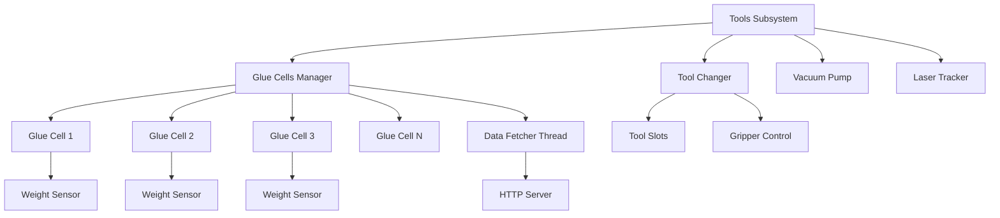

# Tools Subsystem

## Overview

The Tools subsystem manages peripheral devices and equipment used in the glue dispensing system. This includes glue cells with weight monitoring, tool changers, vacuum pumps, and laser tracking systems.

## Architecture



## Components

### 1. Glue Cells Management

**File**: `GlueCell.py`

Manages multiple glue reservoirs with real-time weight monitoring.

#### GlueType Enumeration

```python
class GlueType(Enum):
    TypeA = "Type A"
    TypeB = "Type B"
    TypeC = "Type C"
    TypeD = "Type D"
```

Defines available glue types in the system.

#### GlueCell Class

Represents a single glue cell with weight monitoring.

**Properties**:
- `id` (int): Unique cell identifier
- `name` (str): Cell display name
- `glue_type` (GlueType): Type of glue in cell
- `capacity` (float): Maximum capacity in grams
- `current_weight` (float): Current weight reading
- `min_threshold` (float): Low level warning threshold
- `sensor_config`: Weight sensor configuration

**Methods**:

##### get_weight()
**Returns**: Current weight in grams

##### get_fill_percentage()
**Returns**: Fill level as percentage (0-100)

##### is_low()
**Returns**: bool - True if weight below threshold

##### tare()
Zeros the weight sensor.

**Returns**: Success status

##### update_calibration(offset, scale)
Updates sensor calibration parameters.

**Parameters**:
- `offset` (float): Sensor offset
- `scale` (float): Sensor scale factor

**Returns**: Success status

#### GlueCellsManagerSingleton

Singleton manager for all glue cells in the system.

**Initialization**:
```python
manager = GlueCellsManagerSingleton.get_instance()
```

**Methods**:

##### get_cell(cell_id)
Retrieves specific glue cell.

**Parameters**:
- `cell_id` (int): Cell identifier

**Returns**: GlueCell instance

##### get_all_cells()
**Returns**: List of all GlueCell instances

##### get_weights()
**Returns**: Dictionary of current weights for all cells
```python
{
    1: 450.5,  # grams
    2: 320.8,
    3: 150.2
}
```

##### get_low_cells()
**Returns**: List of cells below minimum threshold

##### publish_weights()
Publishes current weights via MessageBroker.

**Topic**: `glue/weights`

#### GlueDataFetcher

Background thread that continuously fetches weight data from sensors.

**Initialization**:
```python
fetcher = GlueDataFetcher()  # Singleton
fetcher.start()
```

**Features**:
- Runs as daemon thread
- Periodic polling (configurable interval)
- Automatic reconnection on failure
- Averaging filter for stable readings
- Publishes updates via MessageBroker

**Configuration**:

**File**: `storage/glueCells/glue_cell_config.json`

```json
{
  "MODE": "production",
  "SERVER_URL": "http://192.168.1.50:5000",
  "MOCK_SERVER_URL": "http://localhost:5000",
  "POLL_INTERVAL": 1.0,
  "CELLS": [
    {
      "id": 1,
      "name": "Glue Cell A",
      "glue_type": "Type A",
      "capacity": 1000,
      "min_threshold": 100,
      "sensor_config": {
        "loadCellId": 1,
        "offset": 0.0,
        "scale": 1.0
      }
    },
    {
      "id": 2,
      "name": "Glue Cell B",
      "glue_type": "Type B",
      "capacity": 1000,
      "min_threshold": 100,
      "sensor_config": {
        "loadCellId": 2,
        "offset": 0.0,
        "scale": 1.0
      }
    }
  ]
}
```

**Methods**:

##### start()
Starts background data fetching thread.

##### stop()
Stops background thread.

##### get_latest_weights()
**Returns**: Most recent weight readings

#### HTTP Endpoints

The glue weight server provides the following endpoints:

##### GET /weights
Returns current weights for all cells.

**Response**:
```json
{
  "cell1": 450.5,
  "cell2": 320.8,
  "cell3": 150.2
}
```

##### POST /tare?loadCellId={id}
Tares specific load cell.

**Parameters**:
- `loadCellId` (int): Cell to tare

**Response**:
```json
{
  "success": true,
  "message": "Cell tared successfully"
}
```

##### GET /get-config?loadCellId={id}
Gets calibration config for cell.

**Response**:
```json
{
  "loadCellId": 1,
  "offset": 0.0,
  "scale": 1.0
}
```

##### POST /update-config?loadCellId={id}&offset={offset}&scale={scale}
Updates cell calibration.

**Parameters**:
- `loadCellId` (int): Cell ID
- `offset` (float): New offset value
- `scale` (float): New scale factor

### 2. Tool Changer

**File**: `ToolChanger.py`

Automated tool changing system for switching between nozzles/grippers.

#### ToolChanger Class

**Initialization**:
```python
ToolChanger(robot_service: RobotService)
```

**Parameters**:
- `robot_service`: Robot service for motion control

**Methods**:

##### pickup_tool(slot_number)
Picks up tool from specified slot.

**Parameters**:
- `slot_number` (int): Tool slot (1-N)

**Returns**: Success status

**Process**:
1. Move to approach position above slot
2. Lower to pickup position
3. Engage gripper/coupling
4. Lift tool
5. Move to safe position

##### return_tool(slot_number)
Returns current tool to slot.

**Parameters**:
- `slot_number` (int): Target slot

**Returns**: Success status

**Process**:
1. Move to approach position
2. Lower into slot
3. Release gripper/coupling
4. Retract
5. Update current tool tracking

##### get_current_tool()
**Returns**: Currently mounted tool ID

##### is_tool_mounted()
**Returns**: bool - True if tool mounted

**Configuration**:

Tool slot positions defined in robot config:
```json
{
  "tool_changer": {
    "slots": [
      {
        "slot_id": 1,
        "position": [100, 200, 50, 0, 90, 0],
        "tool_type": "nozzle_2mm"
      },
      {
        "slot_id": 2,
        "position": [150, 200, 50, 0, 90, 0],
        "tool_type": "nozzle_5mm"
      }
    ],
    "approach_height": 100,
    "pickup_speed": 50
  }
}
```

### 3. Vacuum Pump

**File**: `VacuumPump.py`

Controls vacuum system for workpiece pickup and holding.

#### VacuumPump Class

**Initialization**:
```python
VacuumPump(io_controller)
```

**Parameters**:
- `io_controller`: I/O control interface (robot or PLC)

**Methods**:

##### enable()
Activates vacuum pump.

**Returns**: Success status

##### disable()
Deactivates vacuum pump.

**Returns**: Success status

##### is_enabled()
**Returns**: bool - Current pump state

##### has_vacuum()
Checks if vacuum pressure sufficient.

**Returns**: bool - True if workpiece secured

**Implementation**:
```python
def enable(self):
    # Activate vacuum solenoid
    self.io_controller.set_digital_output(
        io_index=VACUUM_IO_INDEX,
        value=True
    )
    
    # Wait for vacuum to build
    time.sleep(0.5)
    
    # Verify vacuum achieved
    return self.has_vacuum()

def has_vacuum(self):
    # Read vacuum sensor
    return self.io_controller.get_digital_input(
        io_index=VACUUM_SENSOR_INDEX
    )
```

### 4. Laser Tracker

**File**: `Laser.py`

Laser displacement sensor for height measurement.

**See also**: [VisionSystem/heightMeasuring/LaserTracker.py](../../VisionSystem/heightMeasuring/LaserTracker.py)

#### Laser Class

**Initialization**:
```python
Laser(communication_interface)
```

**Parameters**:
- `communication_interface`: Communication interface (Serial, Modbus, etc.)

**Methods**:

##### get_distance()
**Returns**: Distance measurement in mm

##### get_height(reference_point)
Calculates height relative to reference.

**Parameters**:
- `reference_point` (float): Reference height

**Returns**: Height in mm

##### start_continuous_measurement()
Starts continuous measurement mode.

##### stop_continuous_measurement()
Stops continuous measurement.

##### get_measurement_rate()
**Returns**: Measurement frequency in Hz

**Configuration**:

Laser sensor configuration in settings:
```json
{
  "laser": {
    "type": "keyence_il",
    "communication": {
      "type": "modbus",
      "address": 1,
      "baud_rate": 115200
    },
    "measurement_range": {
      "min": 50,
      "max": 250
    },
    "resolution": 0.01
  }
}
```

### 5. Nozzles

**Directory**: `nozzles/`

Nozzle-specific configurations and parameters.

#### Nozzle Types

Different nozzles for various glue application requirements:
- 2mm round nozzle - Fine lines
- 5mm round nozzle - Standard application
- Flat spray nozzle - Wide coverage
- Precision needle - Micro dots

#### Nozzle Configuration

Each nozzle has specific parameters:
```json
{
  "nozzle_id": "nozzle_2mm",
  "diameter": 2.0,
  "flow_rate": 5.0,
  "pressure_range": {
    "min": 2.0,
    "max": 4.0
  },
  "speed_range": {
    "min": 50,
    "max": 300
  },
  "offset": [0, 0, 25, 0, 0, 0]
}
```

## Integration with Robot System

All tools integrate with the robot service:

```python
# Tool changer
tool_changer = ToolChanger(robot_service)
tool_changer.pickup_tool(slot_number=1)

# Vacuum pump
vacuum = VacuumPump(robot_service.io_controller)
vacuum.enable()

# Laser tracker
laser = Laser(robot_service.communication)
height = laser.get_height(reference_point=0)
```

## Message Topics

Tools publish data via MessageBroker:

| Topic | Publisher | Message |
|-------|-----------|---------|
| `glue/weights` | GlueDataFetcher | Current weights |
| `glue/low-level` | GlueCellsManager | Low level warning |
| `tools/current-tool` | ToolChanger | Current tool ID |
| `vacuum/state` | VacuumPump | Pump state |
| `laser/height` | LaserTracker | Height measurement |

## Usage Examples

### Monitor Glue Levels

```python
from GlueDispensingApplication.tools.GlueCell import GlueCellsManagerSingleton

manager = GlueCellsManagerSingleton.get_instance()

# Get all weights
weights = manager.get_weights()
print(f"Glue levels: {weights}")

# Check for low cells
low_cells = manager.get_low_cells()
if low_cells:
    print(f"Low cells: {[cell.name for cell in low_cells]}")
```

### Change Tool

```python
# Return current tool
tool_changer.return_tool(slot_number=1)

# Pick up different tool
tool_changer.pickup_tool(slot_number=2)

# Verify
current_tool = tool_changer.get_current_tool()
print(f"Current tool: {current_tool}")
```

### Use Vacuum Pickup

```python
# Enable vacuum
vacuum.enable()

# Check if workpiece secured
if vacuum.has_vacuum():
    # Safe to move workpiece
    robot_service.moveToPosition(x, y, z)
else:
    print("Vacuum not achieved - workpiece not secured")
    vacuum.disable()
```

### Measure Height

```python
laser = Laser(communication_interface)

# Get single measurement
distance = laser.get_distance()
print(f"Distance: {distance} mm")

# Continuous monitoring
laser.start_continuous_measurement()
# ... measurements happen in background ...
laser.stop_continuous_measurement()
```

## Calibration

### Glue Cell Calibration

1. **Empty Cell**: Remove all glue
2. **Tare**: Zero the sensor
3. **Known Weight**: Add known weight
4. **Calculate Scale**: Adjust scale factor
5. **Verify**: Check accuracy with multiple weights

```python
cell = manager.get_cell(cell_id=1)

# Tare empty cell
cell.tare()

# Add known weight (e.g., 500g)
# Measure and calculate scale
measured = cell.get_weight()
actual = 500.0
scale = actual / measured

# Update calibration
cell.update_calibration(offset=0, scale=scale)
```

### Laser Calibration

See [VisionSystem/heightMeasuring/README.md](../../VisionSystem/heightMeasuring/README.md)

## Maintenance

### Regular Tasks

1. **Weekly**:
   - Check glue levels
   - Verify vacuum function
   - Clean laser sensor lens
   - Inspect tool changer for wear

2. **Monthly**:
   - Calibrate glue cells
   - Verify laser accuracy
   - Lubricate tool changer mechanism
   - Check vacuum hoses for leaks

3. **Quarterly**:
   - Full system calibration
   - Replace vacuum filters
   - Inspect all sensors
   - Update configuration if needed

## Troubleshooting

### Glue Weight Readings Unstable

- Check sensor connections
- Verify mounting is secure
- Recalibrate cell
- Check for vibration sources

### Tool Changer Not Engaging

- Verify tool slot alignment
- Check coupling mechanism
- Inspect gripper functionality
- Review position accuracy

### Vacuum Not Achieving Pressure

- Check for air leaks in hoses
- Verify pump operation
- Clean suction cups
- Check vacuum sensor

### Laser Measurements Inaccurate

- Clean laser lens
- Recalibrate sensor
- Check target surface reflectivity
- Verify mounting stability

## Safety Considerations

### Glue Handling

- Wear appropriate PPE
- Ensure proper ventilation
- Follow material safety data sheets
- Dispose of waste properly

### Vacuum Safety

- Don't exceed rated capacity
- Secure workpieces before moving
- Test vacuum before critical operations
- Have emergency stop readily accessible

### Laser Safety

- Use appropriate laser class device
- Follow safety interlocks
- Don't look directly into laser
- Post warning signs if required

## Dependencies

- Robot Service for motion control
- MessageBroker for data publishing
- HTTP requests library for weight server
- Serial/Modbus for sensor communication
- Threading for background tasks

## Related Documentation

- [GlueDispensingApplication README](../../../backend/system/README.md)
- [Robot Subsystem](../../../../modules/robot/README.md)
- [VisionSystem/HeightMeasuring](../../VisionSystem/heightMeasuring/README.md)
- [Main System README](../../docs/README.md)

---

**Subsystem Version**: 2.0
**Last Updated**: 2025-11-08
